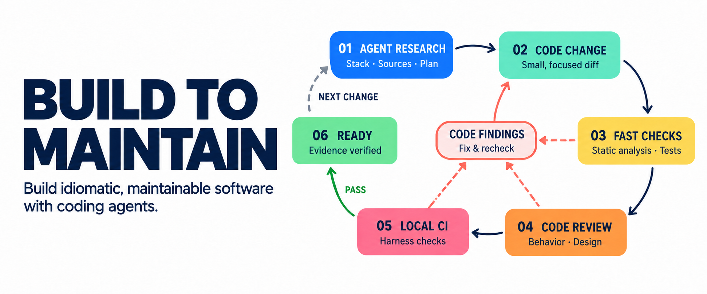
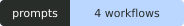
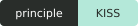
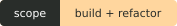
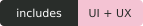

<p align="center">
  
</p>

<p align="center">
  <a href="#choose-your-workflow"></a>
  <a href="#the-standard"></a>
  <a href="prompts/refactor-project.md"></a>
  <a href="prompts/extract-design-system.md"></a>
</p>

**Four practical prompts for coding agents that build idiomatic, maintainable software and improve the projects you already have.**

**Contents** · [Choose a workflow](#choose-your-workflow) · [Try it](#try-it-on-a-real-task) · [The standard](#the-standard) · [Feedback loops](#close-the-loop) · [Local CI](#add-a-local-ci-harness) · [Go deeper](#go-deeper)

## Choose your workflow

<table>
<tr>
<td align="center"><b>01</b></td>
<td>
<h3><a href="prompts/start-project.md">Start a project&nbsp;→</a></h3>
<p>Describe your app; the agent chooses the stack and builds a small complete version.<br><b>You get:</b> running code, justified boundaries and checks.</p>
</td>
</tr>
<tr>
<td align="center"><b>02</b></td>
<td>
<h3><a href="prompts/refactor-project.md">Refactor a project&nbsp;→</a></h3>
<p>Describe what feels hard to change, or let the agent find and fix the most useful problem.<br><b>You get:</b> a bounded patch and evidence for preserved contracts.</p>
</td>
</tr>
<tr>
<td align="center"><b>03</b></td>
<td>
<h3><a href="prompts/extract-design-system.md">Build UI from a reference&nbsp;→</a></h3>
<p>Extract a visual system, adapt it to your content and brand, then compare the result.<br><b>You get:</b> implemented UI and a visual comparison.</p>
</td>
</tr>
<tr>
<td align="center"><b>04</b></td>
<td>
<h3><a href="prompts/improve-user-flow.md">Improve a user flow&nbsp;→</a></h3>
<p>Find where a task breaks down, research the guidance and test a focused change.<br><b>You get:</b> an evidence-led change and a measurement plan.</p>
</td>
</tr>
</table>

Open one prompt, describe your goal in ordinary language and paste the complete block into your agent. Technical details and optional constraints can be left to the agent. For UI work, also supply a reference URL or screenshot. Each workflow includes discovery, research, implementation and verification.

<details>
<summary><b>What access does the agent need?</b></summary>

Coding work needs repository, shell and documentation access. UI work also needs a browser and screenshots. Supply existing user research or analytics for UX work when available. Missing access should produce a specific limitation, never invented observations or a claim that unrun checks passed.

</details>

## Try it on a real task

Start with the [refactoring prompt](prompts/refactor-project.md). A simple request is enough:

```text
Request: This project has become hard to change. Find the most useful
maintainability improvement and implement it without changing how the app works.
Optional limits: Focus on checkout. Leave the public API unchanged.
```

The agent should locate the problem before choosing a patch. If it finds a shipping rule spread across checkout, look for this evidence:

| Decision | Evidence to look for |
|---|---|
| Where does the rule belong? | The traced request path and the module that owns shipping policy. |
| What must stay the same? | Behavior checks for callers, failures and side effects. |
| Did the extraction help? | The caller names the decision; infrastructure stays outside the rule. |
| Is this candidate ready? | Review findings resolved and checks run against the final files. |

This is an illustrative brief. The [research notes](docs/prompt-research.md) explain the workflow decisions; the [review notes](docs/prompt-review.md) give the scoring rubric, scenario checks and limits of the assessment.

## The standard

> **Use the stack's idioms. Keep the design small. Make the next change easier to reason about.**

- **Research before structure.** For a new project, define the first outcome and choose a compatible stack from its constraints and official guidance. For an existing project, inspect manifests, resolved dependencies, runtime versions, entry points and CI; trace real behavior and consult guidance for the versions in use.
- **Keep responsibilities together.** Group code that changes for the same reason. A directory earns a package boundary when ownership, dependencies or deployment need one. A wrapper that merely renames a call adds another concept to learn.
- **Name the intent.** Extract a coherent rule when a good name removes the need to mentally decode it. Keep obvious expressions inline and side effects visible.
- **Use hexagonal architecture where it pays.** For larger backends with substantial domain rules or integrations, prefer an independent application core with ports and adapters. Simple CRUD can stay in cohesive framework modules.
- **Preserve the contract.** Refactoring protects observable behavior, including errors, authorization, rounding, ordering and transactions. A bug fix or API change needs an explicit behavior decision.

<details>
<summary><b>A small example: make the decision readable</b></summary>

```ts
// The caller has to reconstruct the rule.
if (order.paid && !order.cancelled && order.stockReserved) {
  dispatch(order);
}

// Name the rule; keep its implementation close to the caller.
if (isReadyToDispatch(order)) {
  dispatch(order);
}

function isReadyToDispatch(order: Order): boolean {
  return order.paid && !order.cancelled && order.stockReserved;
}
```

The rule is unchanged. The extraction earns its place only if the name helps a reader understand the caller. `processData()` would not help. See [Extract Function](https://refactoring.com/catalog/extractFunction.html).

</details>

For UI, start with a strong reference: **extract its system → map your information architecture → apply your brand → compare matching screens → fix the mismatches**. For changes to user guidance, first establish the current flow, actual criticism and applicable official recommendations. Visual taste and measured usability answer different questions.

[Architecture and package structure →](docs/architecture.md) · [Reference-led UI and evidence-led UX →](docs/design-workflow.md)

## Close the loop

**Research → code → fast checks → review → full validation → ready**

The hero shows two feedback loops. While editing, use static analysis, focused tests and diff review to catch problems quickly. Once the candidate settles, run the project's required validation. A local CI harness can supply that final gate.

| Feedback | Next action |
|---|---|
| A reproducible code defect | Repair it, rerun affected checks and review the revised diff. |
| Missing access, evidence or a broken environment | Diagnose the prerequisite; report what remains blocked. |
| All required checks pass | Confirm acceptance criteria and evidence for the final files, then finish. |

A green run on an older candidate is insufficient. A later code or configuration change needs fresh validation. Stop retrying when attempts produce no new evidence; report the unresolved cause. The dashed return in the hero means **the next task**, not endless work after success.

[Read the researched loop, status rules and stopping conditions →](docs/agent-loop.md)

## Add a local CI harness

> [!TIP]
> **Make quality checks repeatable.** Our [Local CI Harness](https://github.com/CodePawfect/local-ci-harness) validates a working-tree snapshot in pinned containers and keeps the reports local.

It can substantially strengthen quality control by turning configured lint, type, test, build and scan requirements into repeatable gates. Missing evidence for a selected stage is blocked. Use its gate when merge-to-main or push-main intent is explicit; the harness reports results and does not merge or push itself.

Determinism depends on controlled inputs, dependencies and tests. A passing report proves the configured checks passed; it does not establish usability or settle every design decision. The harness is optional. Existing project checks remain useful without it.

## Go deeper

| Guide | What it helps you decide |
|---|---|
| [Architecture without ceremony](docs/architecture.md) | Package structure, single responsibility, useful extractions and hexagonal boundaries. |
| [The engineering loop](docs/agent-loop.md) | When to review, repair, revalidate and stop. |
| [UI and UX workflow](docs/design-workflow.md) | What to borrow from a reference and how to investigate a difficult user task. |
| [Clear technical writing](docs/writing.md) | Specific, natural prose with evidence. Includes a compact editing prompt. |
| [Hero and asset notes](assets/README.md) | The generated diagram, its exact prompts and a reusable image brief. |

Sources sit beside the claims in each guide. Read the [prompt research](docs/prompt-research.md), [scored review](docs/prompt-review.md) and [README design notes](docs/readme-design.md) for the evidence, decisions and limits behind this collection.

---

<p align="center">
  <b>More from CodePawfect</b><br>
  <a href="https://github.com/CodePawfect/build-what-sells">Build What Sells</a> ·
  <a href="https://github.com/CodePawfect/local-ci-harness">Local CI Harness</a>
</p>
