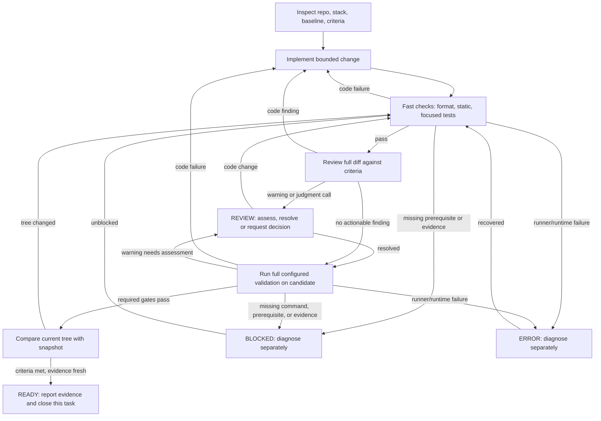

# A bounded engineering loop

Treat each change as a bounded task with observable acceptance criteria. It is READY only when those criteria are met and evidence describes the exact final working tree. The order below is this playbook’s synthesis, not a universal best; adjust it for repository risk, gate requirements, and check cost.

Two harnesses have different jobs here. An **agent harness** coordinates context, model calls, tools and feedback across the task; OpenAI describes that role in [Unrolling the Codex agent loop](https://openai.com/index/unrolling-the-codex-agent-loop/). A **local CI harness** runs configured validation and produces evidence. It is one tool inside the broader engineering workflow.

## Research, change, and fast feedback

Inspect repository instructions, manifests, lockfiles, entry points, tests, build and CI configuration, and local changes. Infer the framework and versions from the repo; consult official documentation for those versions. Record relevant contracts, baseline failures, and acceptance criteria that can be checked. For an empty repo, settle the stack and intended behavior before scaffolding.

Implement the smallest coherent change. Run cheap feedback first: formatting, linting, static or type checks, and focused behavior tests. This order is an inference from speed and scope: Ham Vocke's [Practical Test Pyramid](https://martinfowler.com/articles/practical-test-pyramid.html) puts fast checks early and broader, slower tests later. Martin Fowler's [continuous integration guidance](https://martinfowler.com/articles/continuousIntegration.html) calls for a self-testing build and includes tools such as linters and security scanners in automated verification. Order by actual runtime, not test label; an unusually fast integration check may belong early.

## Review and repair

After fast checks pass, review the full diff against the criteria, contracts, and researched framework guidance. Look for defects, unintended behavior changes, security problems, missing evidence, and unnecessary scope. A separate evaluator can help on complex or long-running work. Anthropic recommends concrete evaluation criteria and a skeptical evaluator for suitable tasks in its [harness design guidance](https://www.anthropic.com/engineering/harness-design-long-running-apps); that extra reviewer is not useful for every small task an agent can reliably handle alone. A focused self-review can be enough.

Send code findings back to implementation, then rerun fast checks. Do not weaken or remove tests, thresholds, or required checks to get a green result. Change a test only when the intended contract has been verified to change, preserving equivalent coverage. Warnings go to REVIEW for assessment; they do not prove every required check passed.

Set a repair budget before starting. Every attempt should produce a justified change, a new diagnostic, or a documented resolution. This playbook's default is to stop after two consecutive attempts at the same failure without new evidence. Report the actual output and what is needed to continue; do not keep rerunning an unchanged failure.

## Full gate, fresh evidence, and status

Run full required validation after code findings are resolved. The optional [Local CI Harness](https://github.com/CodePawfect/local-ci-harness#readme) snapshots the working tree and runs profile-selected stages, including configured static, test and build checks. Its order is profile-driven; early checks may run again inside the authoritative gate. A selected stage without a safe command or verifiable evidence is BLOCKED. Invoke its gate only for explicit merge-to-main or push-main intent. It reports results; it does not merge or push. If this harness is absent, use the project's existing required validation and state that no harness gate ran.

Preserve the report's status: **READY** indicates a successful configured gate; **REVIEW** requires warning assessment; **FAIL** indicates a failed check; **BLOCKED** indicates missing prerequisites or evidence; **ERROR** indicates a runtime problem. Diagnose failures before editing: code, infrastructure and unstable tests need different responses. Never turn a non-ready report into success by bypassing policy. A ready gate alone does not resolve outstanding review findings or prove acceptance criteria.

Final tree comparison is this playbook’s rule, not a claimed Local CI Harness feature: evidence applies to the candidate tested. Compare all tracked and in-scope untracked files that affect the candidate or its checks, including tests, manifests, lockfiles and check configuration. Exclude generated reports from that comparison. If relevant files changed, revalidate the candidate. Handoff requires fresh evidence, satisfied acceptance criteria and resolved blocking findings. Then close the task; unrelated improvements belong to a separate next task.

Anthropic’s [effective harnesses article](https://www.anthropic.com/engineering/effective-harnesses-for-long-running-agents) covers bounded tasks, end-to-end checks, and durable handoffs; [building effective agents](https://www.anthropic.com/engineering/building-effective-agents) discusses feedback and stopping conditions. These support explicit closure, while this guide’s stages and status meanings remain repository choices.
